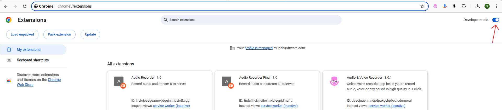

1. Download the folder to your computer.
2. Click on the Chrome extension icon.
.png>)
3. Select "Manage Extensions."
.png>)
4. Enable "Developer Mode."

5. Click "Load Unpacked."
.png>)
6. Choose the folder you just downloaded.
7. After activating the extension, a new tab will open.
8. Click the "Start Recording" button, allow microphone access, and share the tab with your meeting.
9. When finished, click the "Stop Recording" button.

Note: Please ensure you use the extension on the same tab that you shared during the meeting.