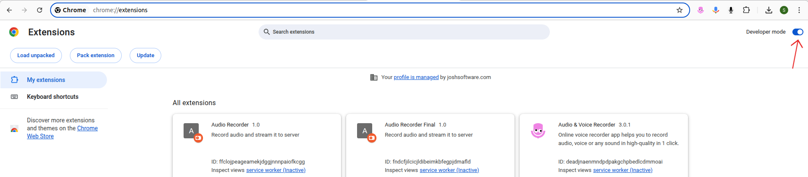

# Lingo.ai Chrome Extension Setup Guide

This guide will walk you through the steps to install and use the **Lingo.ai** Chrome extension.

## Steps for Installation and Usage

### 1. Download the Folder
Download the folder containing the extension to your computer.

### 2. Open Chrome Extensions
Click on the Chrome extension icon located in the top-right corner of your browser.

.png>)

### 3. Manage Extensions
Select **"Manage Extensions"** from the dropdown menu.

.png>)

### 4. Enable Developer Mode
Toggle the **"Developer Mode"** switch to enable it.

### 5. Load the Unpacked Extension
Click on the **"Load Unpacked"** button.

.png>)

### 6. Select the Folder
Choose the folder you just downloaded.

### 7. Activate the Extension
Click on the extension icon in the Chrome toolbar again.

.png>)

### 8. Open the Lingo.ai Extension
Click on the **Lingo.ai** extension from the dropdown menu to activate it.
.png>)

### 9. Start Recording
After activating the extension, a new tab will open. Click the **"Start Recording"** button, allow microphone access, and share the tab with your meeting participants.

### 10. Stop Recording
When finished, click the **"Stop Recording"** button to pause the recording. After that, you can either resume the recording or, if you're completely finished, click the **"Transcribe"** button to have the recording transcribed.

## Important Notes

- Please ensure that you use the extension on the **same tab** that you shared during the meeting.
